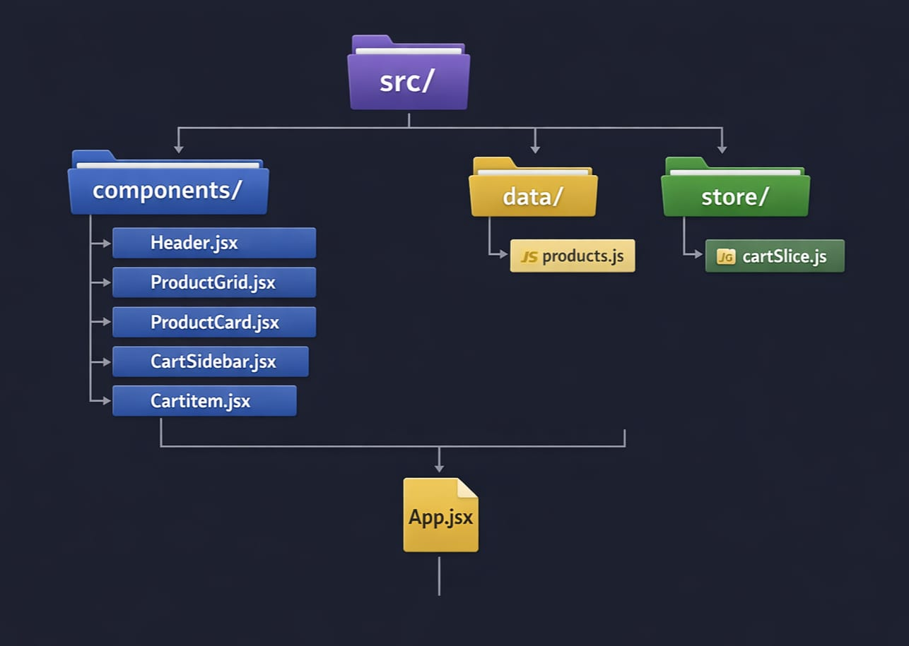

## Ecommerce-web-qcrt

# 🛒QuickCart – ECommerce Web Application 

QuickCart is a modern and responsive eCommerce web application built using React.js, Tailwind CSS, and Redux Toolkit. It allows users to browse products, search items, and manage their shopping cart with real-time updates.

The application focuses on providing a smooth and interactive shopping experience with a clean UI, dynamic state management, and responsive design.

---

## 🧩Components Included

### Header.jsx  
• Displays logo, search bar, and cart icon with real-time item count.

### ProductGrid.jsx  
• Shows all products with search filtering and smooth animations.

### ProductCard.jsx  
• Displays individual product details with rating and add-to-cart functionality.

### CartSidebar.jsx  
• Sliding cart panel to view items, total price, and checkout options.

### CartItem.jsx  
• Handles individual cart item actions like quantity update and remove.

---

## ✨Features

- Responsive UI design using Tailwind CSS  
- Product search functionality  
- Add to cart with real-time updates  
- Dynamic cart sidebar with total calculation  
- Smooth animations using Framer Motion  
- Global state management using Redux Toolkit  

---

## 💻Tech Stack

| Technology       | Use                         |
|----------------|-----------------------------|
| HTML5          | Structure                   |
| CSS3 (Tailwind)| Styling & responsiveness    |
| React.js       | Frontend framework          |
| Redux Toolkit  | State management            |
| Framer Motion  | Animations                  |

---

## 🏗️Project Structure

---

## ⚙️How to Run

1. Clone or download this repository  
2. Install dependencies using `npm install`  
3. Run the project using `npm run dev`  
4. Open the local server link in your browser  

---

## 🚀Future Enhancements

- Product filter option  
- Wishlist feature ❤️  
- User authentication  
- Payment integration  

---

## Author

Placidpio JR